# ABL-Unity3D
ABL-Unity3D is a GUI-based and efficient Genetic Programming (GP) and AI Planning framework designed for agent-based learning (ABL) research. It is directly integrated with Unity3D. We introduce ABL-Unity3D in an attempt to reduce development time and effort and increase performance. Our primary goal is to provide an open-source,
domain-targetable agent-based learning system that provides tools for efficient and user-friendly GP and AI Planning research and development. ABL-Unity3D supports AI experiments that are easy to design and efficient to execute. We aim to introduce a baseline for running AI experiments that require 3D simulation, not a unifying framework for all possible AI experiments. 

The main contribution of ABL-Unity3D is a framework for Unity3D that integrates directly with GP and AI Planning, is easy to configure, has transparent AI components, and is domain-targetable.

In particular, the implementation of GP provided is strongly-typed, i.e., [strongly-typed GP (STGP)](https://www.site.uottawa.ca/~fbinard/EA/GP/Articles/montana94strongly).

See [our paper here](https://doi.org/10.1007/978-981-19-8460-0_3) for more information, as well as experiments showcasing ABL-Unity3D.

<figure><kbd>
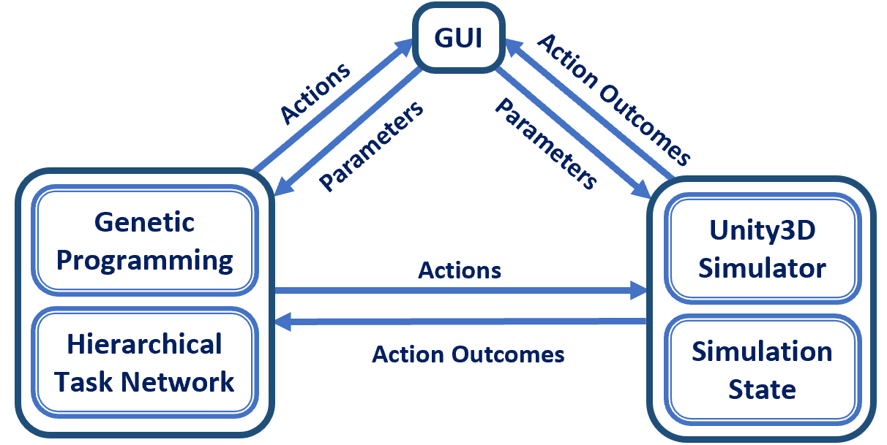
<figcaption aria-hidden="true"><h2>An overview of the components in ABL-Unity3D. Key components are the simulator (Unity3D), AI (GP and AI planning), and GUI</h2></figcaption>
</kbd></figure><br><br>

<figure><kbd>
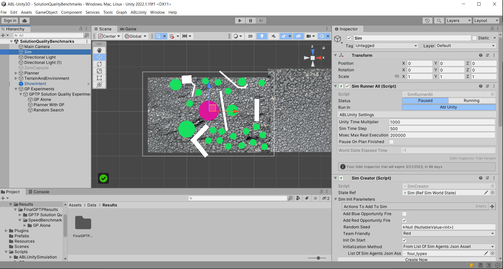
<figcaption aria-hidden="true"><h2>A sample view of ABL-Unity3D.</figcaption></h2>
</kbd></figure><br><br>

# Table Of Contents
- [Requirements](#requirements)
- [Installation Instructions](#installation-instructions)
- [Branches](#branches)
- [GPTP Results](#gptp-results)
- [Recommended Editors](#recommended-editors)
- [Usage Instructions](#usage-instructions)
  * [Run a GP Experiment](#run-a-gp-experiment)
  * [Run the AI Planner](#run-the-ai-planner)
- [Default Simulator Implementation](#default-simulator-implementation)
  * [Simulator World State](#simulator-world-state)
  * [Agents](#agents)
  * [Handles](#handles)
  * [Actions](#actions)
  * [Pathfinding](#pathfinding)
- [Strongly-Typed GP Implementation](#strongly-typed-gp-implementation)
  * [GP Representations](#gp-representations)
  * [GP Search Algorithm](#gp-search-algorithm)
  * [Defining a GP Operator](#defining-a-gp-operator)
  * [Fitness](#fitness)
  * [Defining a Fitness Function](#defining-a-fitness-function)
  * [Defining a Population Initialization Method](#defining-a-population-initialization-method)
- [Planner Implementation](#planner-implementation)
  * [Methods, Task-Specifications and SimActions](#methods--task-specifications-and-simactions)
  * [Task-Specification](#task-specification)
  * [Method](#method)
  * [SimScoringFunction](#simscoringfunction)
- [Graphical User Interface Implementation](#graphical-user-interface-implementation)
- [Scene Components](#scene-components)
  * [Required Components](#required-components)
  * [Optional components](#optional-components)
  * [AI Planner Components](#ai-planner-components)
  * [GP Components](#gp-components)
- [Component Details](#component-details)
  * [SimPrefab](#simprefab)
  * [PathfindingPrefab](#pathfindingprefab)
  * [PlannerPrefab](#plannerprefab)
  * [GpExperimentRunnerPrefab](#gpexperimentrunnerprefab)
  * [GpExperimentPrefab](#gpexperimentprefab)
- [Component Parameters](#component-parameters)
  * [SimPrefab](#simprefab-1)
  * [PathfindingPrefab](#pathfindingprefab-1)
  * [PlannerPrefab](#plannerprefab-1)
  * [GpExperimentRunnerPrefab](#gpexperimentrunnerprefab-1)
  * [GpExperimentPrefab](#gpexperimentprefab-1)

## Requirements
- [git](https://git-scm.com/)
- [git-lfs](https://git-lfs.com/)
- [Unity](https://unity.com/download)
-- Version 2022.1.19f1

## Installation Instructions
To install, run the following git commands:
```
clone github.com/ALFA-group/ABL-Unity3D.git
git lfs install
git lfs pull
```
You can now open the project in Unity.

## Branches

|main|GPTP
--- | --- |
|Most up to date branch|Code used to generate the results shown in our [GPTP paper](https://doi.org/10.1007/978-981-19-8460-0_3)

## GPTP Results
Our GPTP results can be found on the branch `GPTP` within the following zip file: `ABL-Unity3D/ABL-Unity3D/Assets/Data/Results/FinalGPTPResults.zip`

## Recommended Editors
We recommend the following editors, which all claim to be cross platform:
- [Jebtrains Rider](https://www.jetbrains.com/rider/) with the [Unity plugin](https://www.jetbrains.com/help/rider/Unity.html)
- [Visual Studio Code](https://code.visualstudio.com/) with the [Unity plugin](https://code.visualstudio.com/docs/other/unity)
- [Visual Studio Community/Pro/Enterprise](https://visualstudio.microsoft.com/) with the [Unity plugin](https://visualstudio.microsoft.com/vs/unity-tools/)


## Usage Instructions
### Run a GP Experiment

To run one of the sample GP experiments do the following: 
1. Open a scene which contains a `GpExperiment` object as well as `GpExperimentRunner` object (ex. the included `SolutionQualityBenchmarks` scene). See [here](#gp-experiment-prefab) and [here](#gp-experiment-runner-prefab) for information on the `GpExperiment` and `GpExperimentRunner` objects, respectively.
2. Enter play mode.
3. Click the `GpExperiment` object in the hierarchy view. 
4. Click the `Run This Experiment` button at the top of the inspector.

To view the results of the experiment, click on the newly generated object found in the list `Results From Previous Runs` within the `GpExperiment` inspector view. The results include the relevant parameters that the experiment was with, as well as the list of individuals generated across all generations including their fitness scores. 

When viewing an individual from the results of an experiment, you can 
- View a breakdown of its fitness score
- View the genome as a graph
- Simulate the individual within the simulation. 

### Run the AI Planner
To run the sample AI Planner experiment do the following: 
1. Open a scene which contains a `ManyWorldsPlannerRunner` object (ex. the included `SolutionQualityBenchmarks` scene). See [here](#planner-implementation) for information on the `ManyWorldsPlannerRunnerObject`.
2. Enter play mode.
3. Click the `ManyWorldsPlannerRunner` object in the hierarchical view.
4. Click the `Run Planner` button at the top of the inspector view of the `ManyWorldsPlannerRunner` object.

To view the results of the experiment, click on the newly generated object found in the list `Results From Previous Runs` within the `ManyWorldsPlannerRunner` inspector view. The results include the relevant parameters that the experiment was with, as well as the list of individuals generated across all generations including their fitness scores.

When viewing a generated plan within the results of an experiment, you can 
- View a breakdown of its score
- View the plan as a graph
- Simulate the plan within the simulation. 

## Default Simulator Implementation
ABL-Unity3D uses the Unity3D game engine. It is widely used and provides a large and well-documented API for designing simulations and GUIs. Unity3D has a large community-driven base that provides third-party functionality, which is easily integrated using the Unity Asset Store .

ABL-Unity3D allows the user to design a 3D terrain for agents to traverse. ABL-Unity3D uses a third-party A\* agent pathfinding library to allow agents to traverse terrain.

ABL-Unity3D provides parameters for the user to configure, which define how a simulation should run. See [here](#SimPrefabParameters) for more information.

ABL-Unity3D provides a default simulation which has two teams. The simulation models military warfare at the platoon level: a blue team and a red team. The simulation has them fight against each other.

### Simulator World State

The simulator in ABL-Unity3D maintains and gives access to a world state, the class `SimWorldState`, that describes the properties of the simulation. The `SimWorldState` can contain two types of objects: agents and agent actions. 

### Agents
There are two types of agents: <span style="background-color: light-gray">`SimAgent`</span> and <span style="background-color: light-gray">`SimGroup`</span>. <span style="background-color: light-gray">`SimAgent`</span> is a single agent within the world state, and a <span style="background-color: light-gray">`SimGroup`</span> is a group of <span style="background-color: light-gray">`SimAgents`</span>. Every `SimAgent` has an ID (`SimId`) to uniquely represent it. 

A `SimAgent` is essentially a wrapper for group of sub-entities which represent a lower level agent than a military platoon. In particular, `SimAgent.entities` represents a list of what we call `SimEntity` which defines a sub-agents attributes such as damage, health, etc. In the future, we will simplify this default implementation as it is highly specific for a sample implementation.


### Handles
In addition, we also use a class called `Handle<SimAgent>`, which is essentially a reference to a `SimAgent`. This is necessary for two reasons.  
1. If we pass around a `SimAgent`, we will be passing around an outdated version whose field values are from a previous simulation time of the world state. Thus, this is used to make sure we are getting current values related to the `SimAgent`.
2. It saves memory space.

A `Handle` uses a `SimId` to keep track of which `SimAgent` is being referenced.

The class `SimWorldState` provides the method `Get` to convert a `Handle<SimAgent>` to a `SimAgent`.


### Actions

Agent actions are called <span style="background-color: light-gray">`SimAction`</span>.<span id="SimAction" label="SimAction"></span> A `SimAction` can be one of four types:
1. `SimActionPrimitive`
	- Ideally, all direct changes to the world state happen through these primitives.
	- Does not add actions to the sim world state.
	- Is not composed of other `SimAction`s
2.  `SimActionCompound`
	- A  composition of one or more `SimAction`s.
3. `SimActionSequential`
	- A type of `SimActionCompound` which takes in a list of `SimAction`s to perform sequentially.
4. `SimActionParallel`
	- A type of `SimActionCompound` which takes in a list of `SimAction`s to perform in parallel.

Here we provide a partial sample implementation of a `SimActionPrimitive` called `ActionAttack`. The goal of this `SimAction` is to attack a target `SimAgent` with a `SimGroup`. This is a simplified version of the class `ActionAttackToDestroy` in the codebase. 

We show the methods `Execute` and `GetStatus`, `DrawIntentDestructive`, and `GetUsefulInspectorInformation`. The `Execute` method defines how a `SimAction` will be evaluated within the simulation. The `GetStatus` method defines how to determine whether a `SimAction` has completed execution or not. The `DrawIntentDestructive` creates a visualization of the action within the simulator. `GetUsefulInspectorInformation` returns a string which provides useful information for the action within the GUI.

```csharp
1.  public class ActionAttack : SimActionPrimitive  
2.  {  
3.     public Handle<SimAgent> target;  
4.   
5. 	   public override void Execute(SimWorldState state)  
6. 	   {  
7. 	       var targetAgent = state.Get(this.target);  
8. 	       foreach (var attackerAgent in this.actors.Get(state))  
9.         {  
10.             foreach (SimEntity entity in attackerAgent.entities)  
11.             {  
12.                 if (entity.CanFire)  
13.                 {  
14.                     entity.AttackDirect(state, attackerAgent, targetAgent);  
15.                 }  
16.             }  
17.         }  
18.    }  
19.	  
20.    public override StatusReport GetStatus(SimWorldState state, bool useExpensiveExplanation)  
21.    {  
22.        var targetAgent = state.Get(this.target);  
23.        if (targetAgent.IsDestroyed)  
24.            return new StatusReport(ActionStatus.CompletedSuccessfully, "Target Is Dead", this);    
25.        return new StatusReport(ActionStatus.InProgress, "Target is not dead", this);  
26.    }
27. 
28.    public override void DrawIntentDestructive(SimWorldState currentStateWillChange, IIntentDrawer drawer)  
29.    {  
30.        var performingTeam = this.GetPerformingTeam(currentStateWillChange);  
31.        var targetPosition = this.target.Get(currentStateWillChange).positionActual;  
32.        drawer.DrawText(performingTeam, targetPosition, "Attack");  
33.    }  
34.   
35.    public override string GetUsefulInspectorInformation(SimWorldState simWorldState)  
36.    {  
37.        if (!this.target.IsValid) return "Invalid Target";    
38.        var targetAgent = simWorldState.Get(this.target);  
39.        return $"Agent: {targetAgent.ToString()}, Position: {targetAgent.positionActual}";  
40.    }
41. }

```
The `Execute` method first retrieves the current information for the target agent from the given `SimWorldState` in line 6. Then lines 8-17 loops through all entities of each friendly agent defined in the task-specification, and if an entity is currently able to attack the target agent, attack that target agent with the given entity.

The `GetStatus` method first retrieves the current information for the target agent from the given `SimWorldState` in line 22. Then line 23 checks if the target agent is destroyed. If it is, return a `StatusReport` which says that the action has completed successfully (`ActionStatus.CompletedSuccessfully`), with a helper string that says that the target is dead, as well as a helper variable which defines what `SimAction` has returned this `StatusReport`. Otherwise, return a `StatusReport` which says the action is still in progress (`ActionStatus.InProgress`), which includes  ahelper string that says the target is not dead, as well as a helper variable which defines what `SimAction` has returned this `StatusReport`.

The `DrawIntentDestructive` method draws the text `Attack` over the targetted enemy. Line 30 gets the team which is attacking the enemy, because that determines the color and background color of the text written. Line 31 retrieves the position of the target enemy. Then line 32 calls the `IIntentDrawer.DrawText` method with the values retrieved in the previous two lines as arguments.

The `GetUsefulInspectorInformation` method returns a string with information about the target enemy. Line 37 checks if the target enemy is valid. If not, it will return "Invalid Target". Line 38 retrieves the target enemy as a `SimAgent` using method `SimWorldState.Get` which takes in the target enemy `Handle`. Finally, line 38 returns a string which contains the target enemy as a string (which includes its team, `SimId`, and a user defined name), as well as its position

### Pathfinding
By default, our simulator uses the [A* Pathfinding Project](https://arongranberg.com/astar/) to provide pathfinding capabilities for `SimAgent`s. By default, pathfinding works on any mesh renderer within the scene. In addition, the pathfinding efaults to using [NavMeshCut](https://arongranberg.com/astar/docs/navmeshcutting.html) objects to modify the NavMesh generated. The default implementation uses a [RecastGraph](https://arongranberg.com/astar/documentation/rts_4_1_18_5eec8424/recastgraph.html). It is possible to change this. <a name="PathFindingCache"></a>In addition to the capabilities defined in the [A* Pathfinding Project documentation](https://arongranberg.com/astar/docs/), we also provide the capability to cache pathfinding results. I.e., cache paths from different points along the map that agents move along throughout a simulation. This is only useful when the terrain does not have moving objects which affects the pathfinding. Can be enabled or disabled.

## Strongly-Typed GP Implementation
One key innovation of GP in ABL-Unity3D is the GP solution and fitness function implementations which are designed to achieve a fast, extendable and user-friendly GP framework. Another key innovation is the ability of the GP to interface with the AI Planner, Simulator, and GUI.

### GP Representations
**NOTE**: Some implementation specifics have been changed since the publication of our [paper here](https://doi.org/10.1007/978-981-19-8460-0_3).

ABL-Unity3D provides a standard [strongly-typed GP implementation](https://www.site.uottawa.ca/~fbinard/EA/GP/Articles/montana94strongly) with the option for different initialization methods and genetic operators. ABL-Unity3D represents GP solutions as tree data structures . Each GP node in the tree has an evaluation type. When ABL-Unity3D evaluates a GP node, it returns that type.
Figure <a href="#gpResults" data-reference-type="ref" data-reference="gpResults">2</a> shows a visualization (generated by ABL-Unity3D) of a GP primitive written to represent a conditional statement. This implementation of a conditional statement evaluates to a <span style="background-color: light-gray">`SimAction`</span>.

<figure><kbd>
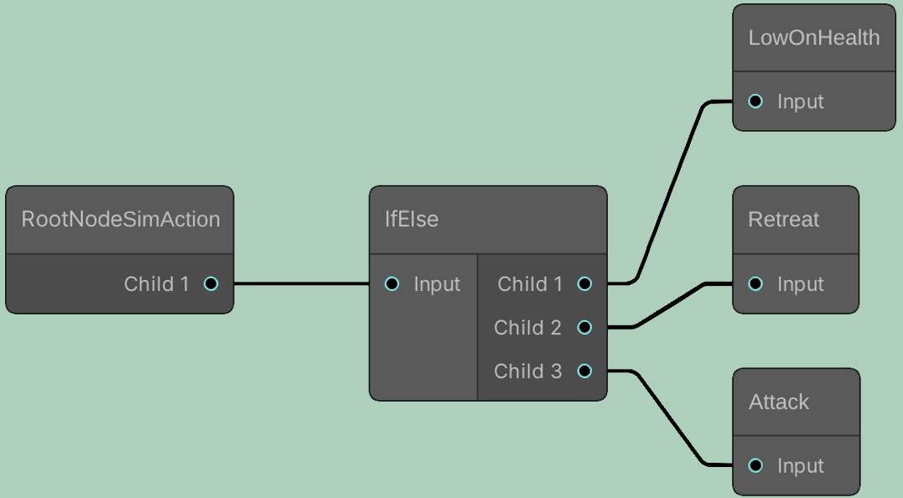
<figcaption aria-hidden="true"><h2>Visualization of a GP solution that
represents a conditional statement which evaluates to a <span
style="background-color: light-gray"><code>SimAction</code></span> in
ABL-Unity3D.</figcaption></h2>
</kbd></figure><br><br>

The root node of the tree represents the evaluation type of the tree. The root node must have one child node with the same evaluation type as the root node. For example, the conditional statement in Figure <a href="#gpResults" data-reference-type="ref" data-reference="gpResults">2</a> evaluates to a <span style="background-color: light-gray">`SimAction`</span>. The root node type `RootNodeSimAction` shows this. The other nodes can have any number of child nodes and be named anything.

### GP Search Algorithm
We provide a standard GP search algorithm with the capabilities for co-evolution, as well as asynchronous individual evaluation. Whether the search algorithm uses co-evolution or asynchronous individual evaluation is determined by the user-provided fitness function. See [here](#defining-a-fitness-function) for more information on how to define a fitness function.

The GP uses [reflection](https://learn.microsoft.com/en-us/dotnet/csharp/programming-guide/concepts/reflection) to find user-defined GP operators, which are then used in the search algorithm to generate individuals.

In addition, the user must provide a probability distribution for the different GP operators. This probability distribution is used by the GP search algorithm to randomly generate individuals. See [here](#gpexperimentprefab) for more information.

Lastly, ABL-Unity3D provides the option to use multiple different population initialization methods. By default, random and ramped initialization are included. The user can create their own.

**NOTE:** We use the terms "genome", "node", and "tree" interchangebly.

### Defining a GP Operator
<span style="background-color: light-gray">`GpBuildingBlock<T>`</span> is the super-class for GP primitives where <span style="background-color: light-gray">`T`</span> is the evaluation type. `GpBuildingBlock<T>` extends the class `Node`, which is a generic class for a genome with no strong typing. <span style="background-color: light-gray">`GpBuildingBlock<T>.children`</span> is the list of child nodes. Child nodes extend <span style="background-color: light-gray">`GpBuildingBlock<T>`</span>. A GP primitive must define a constructor which passes all child nodes to the primitive base constructor. A GP primitive must also override the function <span style="background-color: light-gray">`Evaluate`</span>, which returns the result of the GP primitive upon evaluation. The return type of <span style="background-color: light-gray">`Evaluate`</span> must be the same as the evaluation type <span style="background-color: light-gray">`T`</span> for the GP primitive.

The following figure shows sample code for defining the conditional statement GP primitive shown in Figure <a href="#gpResults" data-reference-type="ref" data-reference="gpResults">2</a>. The GP primitive <span style="background-color: light-gray">`Conditional`</span> has an evaluation type of <span style="background-color: light-gray">`SimAction`</span>, as shown by line 1. Lines 3-8 are helper properties used for visualization. Lines 10-13 define the constructor for <span style="background-color: light-gray">`Conditional`</span> class. Lastly, lines 15-20 define the <span style="background-color: light-gray">`Evaluate`</span> method. Line 17 first evaluates the child node, which represents the condition for the conditional. If true, return the evaluation of the child node <span style="background-color: light-gray">`TrueBranch`</span>, as shown by line 18. Otherwise, return the evaluation of the child node <span style="background-color: light-gray">`FalseBranch`</span>, as shown by line 19.

```csharp
1. public class Conditional : GpBuildingBlock<SimAction> 
2. {
3.      public GpBuildingBlock<bool> Cond => 
4.          (GpBuildingBlock<bool>) this.children[0];
5.      public GpBuildingBlock<SimAction> TrueBranch => 
6.          (GpBuildingBlock<SimAction>) this.children[1];
7.      public GpBuildingBlock<SimAction> FalseBranch => 
8.          (GpBuildingBlock<SimAction>) this.children[2];
9. 
10.      public Conditional(
11.         GpBuildingBlock<bool> cond, 
12.         GpBuildingBlock<SimAction> trueBranch,
13.         GpBuildingBlock<SimAction> falseBranch) : base(cond, trueBranch, falseBranch) { }
14. 
15.     public override SimAction Evaluate(GpFieldsWrapper gpFieldsWrapper) 
16.     {
17.          return Cond.Evaluate(gpFieldsWrapper) ? 
18.                 TrueBranch.Evaluate(gpFieldsWrapper) : 
19.                 FalseBranch.Evaluate(gpFieldsWrapper);
20.     }
21. }
```
Child nodes of a GP primitive can be immutable; genetic operators can not modify them. For example, in replace line 6 with a hard-coded instance of a subclass of <span style="background-color: light-gray">`GpBuildingBlock<T>`</span> in Figure <a href="#sampleCode" data-reference-type="ref" data-reference="sampleCode">sampleCode</a>. E.g., an instance of the GP primitive `Attack`.

### Fitness
**NOTE**: The implementation of the `Fitness` class is due to an old design of the code which no longer makes sense, but it is a pain to change due to serialization. This will be changed soon in the future. Basically, if you want to use the `Fitness` class, you can ignore either the "pure" fitness function score, *xor* the score provided by a `SimScoringFunction`.

Fitness scores are implemented through the class `Fitness`. Currently, the `Fitness` class breaks a fitness score down into two parts:
1. A "pure" fitness score
2. A score provided by a `SimScoringFunction`


### Defining a Fitness Function
**Note** This will be updated in the future, in particular we will remove `IUsesPlanner`, decouple this from `SimScoringFunction`, as well as make all fitness functions be async by default to simplify implementation.

To define a fitness function, define a class that extends <span style="background-color: light-gray">`FitnessFunction`</span>. In addition, the sub-class must implement several different interfaces. It must implement <span style="background-color: light-gray">`IAsync`</span> or <span style="background-color: light-gray">`ISync`</span> depending on whether the fitness function is asynchronous. It must also implement <span style="background-color: light-gray">`IUsesSuppliedSimWorldState`</span> or <span style="background-color: light-gray">`ICreatesSimWorldState`</span>, which defines whether the fitness function takes the simulation world state as an input or whether it generates its own. Lastly, if the fitness function works with the AI Planner, it must implement the interface <span style="background-color: light-gray">`IUsesPlanner`</span>. Note that the sub-class must implement a constructor, and the evaluation function  
<span style="background-color: light-gray">`EvaluateIndividual`</span>/<span style="background-color: light-gray">`EvaluateIndividualAsync`</span>.

Currently, a fitness function must define a constructor which takes in a [`SimScoringFunction`](#simscoringfunction), as well as a weight associated with it. This is due to an old design chance which doesn't make sense anymore, but it is a pain to change due to serialization. This will be changed in a future update.

Below is the implementation of the fitness function which we used to evaluate the `NProngs` scenario described [here](#planner-prefab). Lines 1-3 define that the fitness function is to be run asynchronously, uses a supplied `SimWorldState`, and uses the planner. Lines 5-8 define the constructor. Lines 10-20 define the fitness evaluation  method. Lines 12-13 check if the given individual has the correct return type, aka `NProngsPlan`. If so, cast it to the correct type, because `Individual.genome` is of type `Node`, a super class which does not contain the method `GpBuildingBlock<TReturnType>.Evaluate`. Line 14 then evaluates the genome, which returns a `Plan` generated by the planner. Line 15 gets the `SimWorldState` at the end of executing the generated plan, which may be null. If it is null, then throw an exception. The end state being null is due to legacy code. This will be updated soon. Then line 16 uses the given `SimScoringFunction` to assign a score to the end state. Lastly, line 17 returns the fitness score, where the "pure" fitness score is zero, and the `SimScoringFunction` score is the score defined in line 16 multiplied by the weight provided by the user. See [here](#fitness) for an explanation of the `Fitness` class. Again, the current implementation of the `Fitness` class is due to an old design decision that does not make sense anymore, but is a pain to change, and will be changed soon. 

```csharp
1.  public class NProngsFitnessFunction :   
2.      FitnessFunction, IAsync,   
3.      IUsesASuppliedSimWorldState, IUsesPlanner  
4.  {  
5.      public NProngsFitnessFunction(SimScoringFunction simScoringFunction, double simScoringFunctionWeight)  
6.          : base(simScoringFunction, simScoringFunctionWeight)  
7.      {  
8.      }  
9.     
10.      public async UniTask<Fitness> GetFitnessOfIndividualAsync(GpRunner gp, Individual i)  
11.     {  
12.         var genome = i.genome as NProngsPlan ??   
13.                      throw new Exception($"Genome is not of type {nameof(NProngsPlan)}");  
14.         var plan = await genome.Evaluate(new GpFieldsWrapper(gp));  
15.         var endState = plan.endState ?? throw new Exception("The end state for the generated plan is not defined");
16.         var simScore = this.simScoringFunction.EvaluateSimWorldState(endState);  
17.         return new Fitness(0, this.simScoringFunctionWeight * simScore);
18.     }  
19. }
```


### Defining a Population Initialization Method

To define a custom population initialization method, you must create a class which extends `PopulationInitializationMethod` and implements the method `GetPopulation<T>` where `T` either the type of the genome to be generated, or is the solution return type of the genomes to be generated. The method takes a `GpRunner` instance which implements the GP search algorithm, as well a `TimeoutInfo` instance which defines the method which keeps track of whether a breakout has been requested, or whether the given time limit has been reached. Because `GetPopulation<T>` provides asynchronous capabilities, it returns an awaitable list of individuals, ie. `Task<List<Individual>>`.  See [here](https://learn.microsoft.com/en-us/dotnet/api/system.threading.tasks.task?view=net-6.0) for information on asynchronous operations through the use of `Task`. 

Below is the implementation of randomized population initialization provided by `ABL-Unity3D`. Line 5 defines the initially empty population. Line 6 create a loop which ends either when the size of `population` reaches the user-provided parameter `populationSize`, or the user-provided time limit has been reached. Then line 8-9, using the method `GpRunner.GenerateRandomTreeFromTypeOrReturnType<T>`, a random genome is generated of either type `T` or of return type `T`. This method takes in the maximum depth parameter provided by the user. `GpRunner.GenerateRandomTreeFromTypeOrReturnType<T>` takes the parameter `forceFullyGrow` which defines whether the random genome generated must be as large as possible. Line 10 then takes the random genome generated and creates an individual from it. Line 11 then evaluates the individual and assigns it a fitness score using the method `GpRunner.EvaluateFitnessOfIndividual`. Line 12 then adds this new individual to the population. Lastly, line 14 returns the generated population.

```csharp
1.  public class RandomPopulationInitialization : PopulationInitializationMethod
2.  {  
3.      public override async Task<List<Individual>> GetPopulation<T>(GpRunner gp, TimeoutInfo timeoutInfo)
4.      {   
5.          var population = new List<Individual>();  
6.          for (int i = 0; i < gp.populationParameters.populationSize && !timeoutInfo.ShouldTimeout; i++)  
7.          {  
8.              const bool forceFullyGrow = false;
9.              Node randomTree = gp.GenerateRandomTreeFromTypeOrReturnType<T>(gp.populationParameters.maxDepth, forceFullyGrow);  
10.             var ind = new Individual(randomTree);  
11.             await gp.EvaluateFitnessOfIndividual(ind);  
12.             population.Add(ind);  
13.         }            
14.         return population;  
15.     }  
16. }
```

## Planner Implementation
ABL-Unity3D implements a [hierarchical task network (HTN)](10.48550/ARXIV.1403.7426) that generates all possible plans for agent behavior instead of finding a single plan that satisfies the given goal method. To do this, The planner decomposes a goal method into a set of sub-methods that achieve the given goal. The methods chosen are then implemented using concrete <span style="background-color: light-gray">`SimAction`</span>s, which then execute in the simulation. The AI Planner generates plans depth-first, but this can be modified. The class which implements the HTN is called `ManyWorldsPlanner`. The Unity object which provides parameters and exposed methods to run the HTN is called `ManyWorldsPlannerRunner`

In addition, it is possible to use the AI Planner with GP in ABL-Unity3D. 

For example, suppose we have the “Attack Area” action, which sends agents to attack enemy agents in a specified area. This action could decompose into the sequence of actions “Approach Area” and then “Engage Enemy”. The action “Approach Area” could then decompose into the action “Approach In Single Group” or the action “Approach in Multiple Groups”. The HTN will look at both possibilities and choose the one that performs the best. See <a href="#fig:htn" data-reference-type="ref" data-reference="fig:htn">3</a> for a visualization. Note that we use the terms AI Planner and HTN interchangeably.

<figure><kbd>
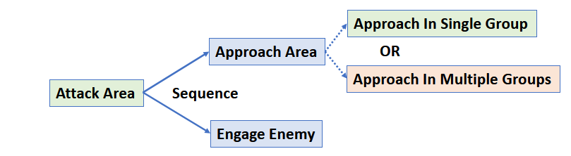
<figcaption aria-hidden="true"><h2>A depiction of the possible decompositions for an action that sends agents to attack enemy agents in a specified area.</figcaption></h2>
</kbd></figure><br><br>

### Methods, Task-Specifications and SimActions
The `Method` class is an abstract way of describing how to complete a task. A method for the planner takes in a task-specification (a class or struct which implements `ITaskSpec`). A task-specification defines fields which are to be used within the execution of a `SimAction`. 

### Task-Specification
Here is an example of a task-specification which abstractly says for a a group of agents to attack a single agent:
```csharp
public struct SpecAttack : ITaskSpec  
{  
    public Handle<SimAgent> target;  
    public SimGroup attackers;  
}
```

In the sample code, `target` is the `Handle` which points to the `SimAgent` which is being targeted by the `SimGroup` called `attackers`.

### Method
The following is a sample implementation of a method which uses the task-specification `SpecAttack`:
```csharp
public MethodAttack(SpecAttack prototype) : base(prototype)  
{  
}  
  
public override IEnumerable<Decomposition> Decompose(PlannerContext context)  
{  
    yield break;  
}  
  
public override SimAction GetActionForSim(SimWorldState state)  
{  
    return new ActionAttack
    {  
        actors = this.taskSpec.attackers,  
        target = this.taskSpec.target  
    };  
}
```
The method `MethodAttack` simply evaluates to a `SimAction` called `ActionAttack` whose goal is to destroy a target using a group of agents defined in the task-specification `SpecAttack`. In addition, the method does not decompose because in this sample implementation this is a primitive attack.

### SimScoringFunction
A `SimScoringFunction` is a function used for assigning scores to simulation world states using a list of given scoring criterion and weights associated with them. This is currently used by both the Planner and the GP.  In particular, `SimScoringFunction` contains a list of the class `SimScoringCriterionAndWeight`. A `SimScoringCriterionAndWeight` has two fields: a `weight` field of type double, and a `criterion` field of type `SimScoringCriterion`. 

A `SimScoringCriterion` class must implement the method `CalculateScore`, as well as assign a value to the property `Title`. The method `CalculateScore` takes in a `SimWorldState` and returns a `double` to represent a score. The property `Title` is a helper string to identify the `SimScoringCriterion`. 

Here is a sample implementation of a `SimScoringCriterion` which get the average health of every entity across all `SimAgents`:
```csharp
1.  public class AverageHealth : SimScoringCriterion  
2.  {  
3.      public override string Title { get; } = "AverageHealth";
4.     
5.      public override double CalculateScore(SimWorldState state)  
6.      {  
7.          double totalCurrentHealth = 0;  
8.          double totalMaximumHealth = 0;  
9.          foreach (SimAgent friendly in state.Agents)  
10.         {  
11.             foreach (SimEntity entity in friendly.entities)  
12.             {  
13.                 totalCurrentHealth += entity.CurrentHealth;  
14.                 totalMaximumHealth += entity.MaxHealth;  
15.             }  
16.         }  
17.   
18.         return totalCurrentHealth / totalMaximumHealth;  
19.     }  
20. }
```

Line 3 defines the `Title` to be `AverageHealth`. Then, lines 7-16 of the `CalculateScore` method get the total sum of current health across all entities, as well as the total sum of maximum health across all entities. Then line 18 returns the average health across all entities across all `SimAgent`s.


## Graphical User Interface Implementation

In order to be more user-friendly, the ABL-Unity3D graphical user interface (GUI) attempts to facilitate interaction with the simulator and AI, see Figure <a href="#fig:simulation" data-reference-type="ref" data-reference="fig:simulation">4</a>. The ABL-Unity3D GUI capabilities include, but are not limited to:

-   Defining simulation parameters. See Figure <a href="#fig:simParams" data-reference-type="ref" data-reference="fig:simParams">8</a>;

-   Running GP experiments and AI Planning experiments. Figure <a href="#gpParametersUI" data-reference-type="ref" data-reference="gpParametersUI">11</a> shows the UI for defining a GP experiment. Figure <a href="#fig:aiPlannerParams" data-reference-type="ref" data-reference="fig:aiPlannerParams">7</a> shows the UI for defining the parameters to the AI Planner;

-   Examination of results. Figure <a href="#viewResults" data-reference-type="ref" data-reference="viewResults">9</a> shows the UI for examining the results of a GP experiment. Figure <a href="#fig:plansUI" data-reference-type="ref" data-reference="fig:plansUI">6</a> shows the UI for examining the results of the AI Planner;

-   Visualization of GP and AI Planner results. Figure <a href="#gpResults" data-reference-type="ref" data-reference="gpResults">2</a> shows the UI for viewing a GP individual. The AI Planner uses the same UI;

-   Examination of the simulation world state and results generated from experiments. Figure <a href="#simExamine" data-reference-type="ref" data-reference="simExamine">10</a> shows the UI to examine agent attributes;

-   Visualization of the actions an agent performs as the scenario simulates. See Figure <a href="#fig:samplePlan" data-reference-type="ref" data-reference="fig:samplePlan">5</a>.

<figure><kbd>
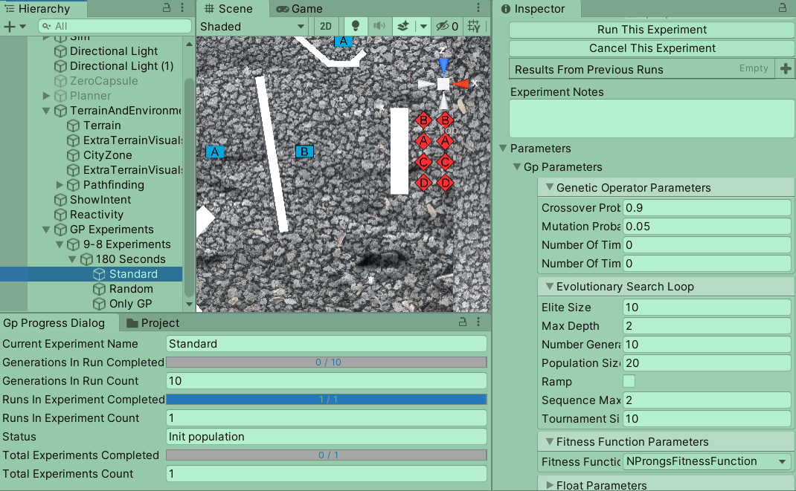
<figcaption aria-hidden="true"><h2>A sample view of a simulation and GP GUI.</figcaption></h2>
</kbd></figure><br><br>

<figure><kbd>
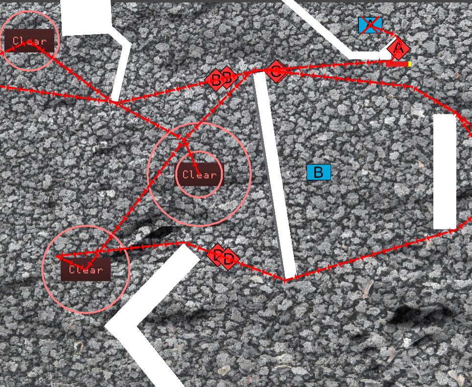
<figcaption aria-hidden="true"><h2>The visualization of agents performing actions as a scenario is simulating.</figcaption></h2>
</kbd></figure><br><br>

<figure><kbd>
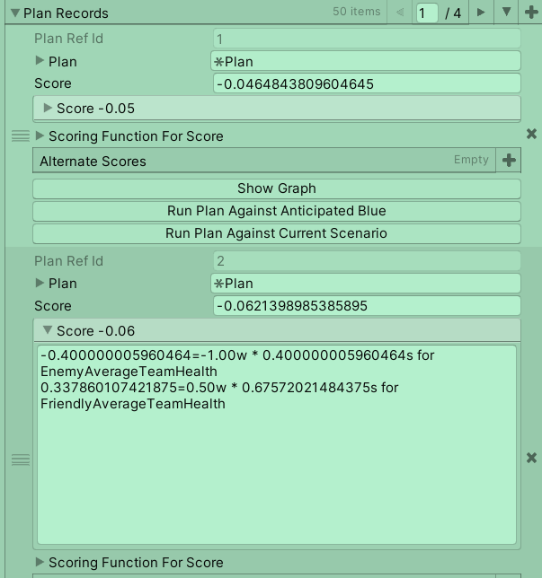
<figcaption aria-hidden="true"><h2>The UI for viewing the results of the AI Planner</figcaption></h2>
</kbd></figure><br><br>

<figure><kbd>
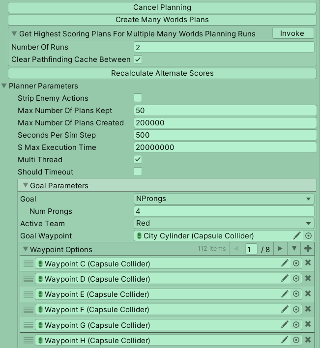
<figcaption aria-hidden="true"><h2>The UI for defining parameters for the AI Planner</figcaption></h2>
</kbd></figure><br><br>

<figure><kbd>
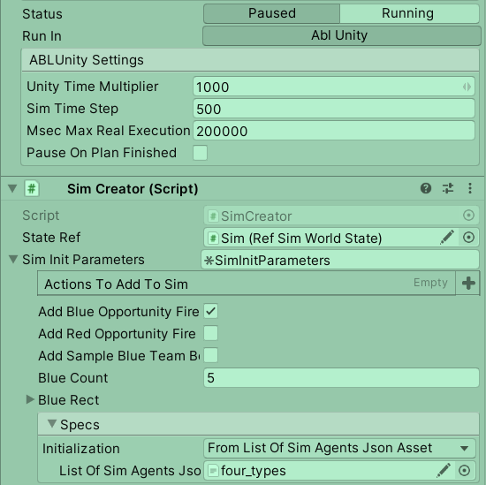
<figcaption aria-hidden="true"><h2>The UI for defining simulation parameters</figcaption></h2>
</kbd></figure><br><br>

<figure><kbd>
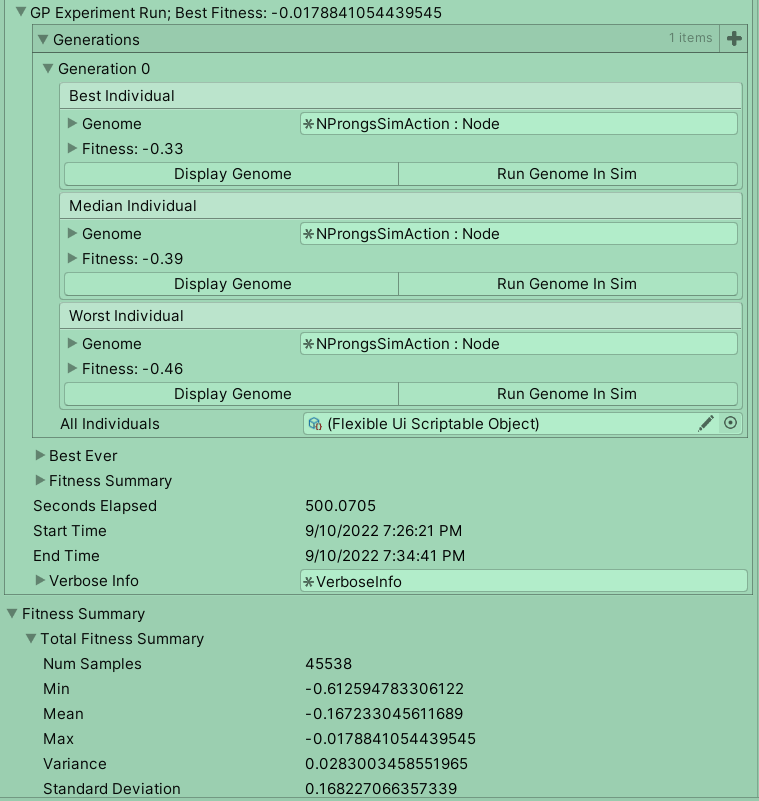
<figcaption aria-hidden="true"><h2>The UI for viewing the results of a GP experiment.</figcaption></h2>
</kbd></figure><br><br>

<figure><kbd>
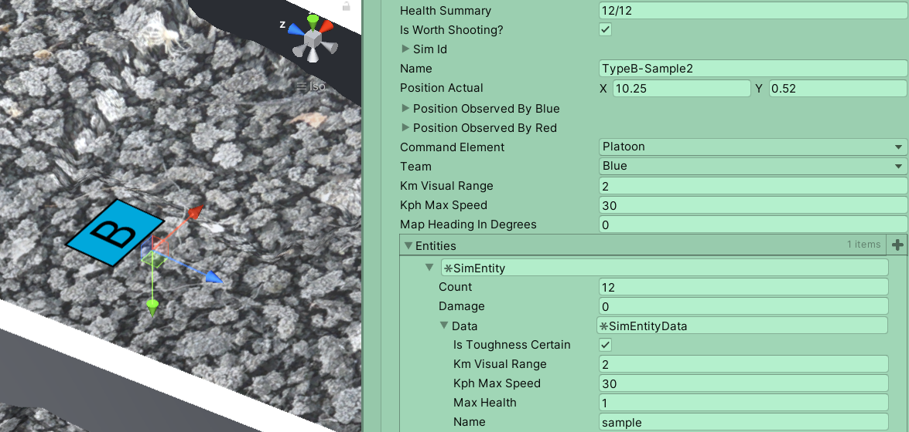
<figcaption aria-hidden="true"><h2>The UI for viewing attributes of <span style="background-color: light-gray"><code>SimUnit</code></span>s, such as location, health, etc.</figcaption></h2>
</kbd></figure><br><br>

<figure><kbd>
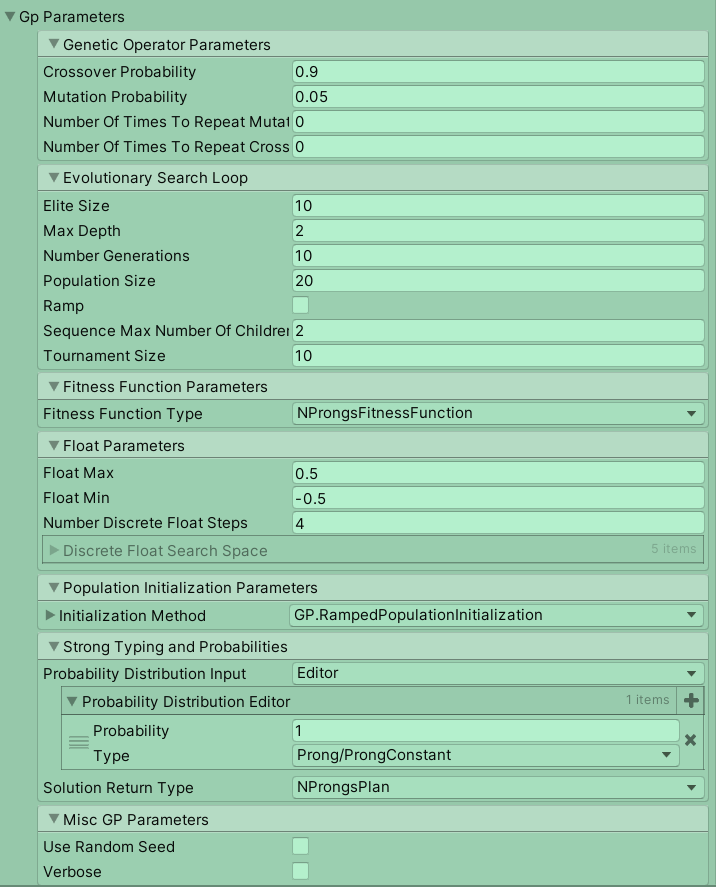
<figcaption aria-hidden="true"><h2>Part of the UI to define and run a GP experiment and view and save results.</figcaption></h2>
</kbd></figure><br><br>
<br />

The ABL-Unity3D GUI implementation is object-oriented and exposes properties to the user. ABL-Unity3D makes it easy to swap out the simulation because the simulation world state is decoupled from the GP and the AI Planning. The only aspects of the GP and AI Planning components that depend on the simulation world state are user-defined GP primitives, fitness functions, and AI Planning methods.

## Scene Components
### Required Components
A scene must contain the following components:
- Terrain mesh
	- This can be any shape or size
- [`SimPrefab`](#SimPrefabExplanation)
	- A prefab which defines the parameters for the simulation.

### Optional components
The following are components which provide different capabilities
- [`PathfindingPrefab`](#PathfindingPrefabExplanation)
	- A* pathfinding scripts (see [here](https://arongranberg.com/astar/) for details on the A* pathfinding library we use).
- [`ShowIntentPrefab`](#ShowIntentPrefabExplanation)
	- Adds animation to [`SimActions`](#SimAction)
### AI Planner Components
- [`PlannerPrefab`](#PlannerPrefabExplanation)
	- Parameters and scripts to run the AI Planner
### GP Components
- [`GpExperimentRunnerPrefab`](#GpExperimentRunnerPrefabExplanation)<a name="GpExperimentRunnerPrefab"></a>
	- A wrapper for running one or more GP Experiments
	- One of two scripts necessary to run a GP experiment. 
	- Must have a child object which is a [`GpExperimentPrefab`](#GpExperimentPrefab).
	
- [`GpExperimentPrefab`](#GpExperimentPrefabExplanation)
	- Defines the parameters to an experiment. 
	- One of two scripts necessary to run a GP experiment
	- Must have a parent object which is a [`GpExperimentRunnerPrefab`](#GpExperimentRunnerPrefab).


## Component Details 
There must be only one of each of the following components per scene:
### SimPrefab
The included implementation includes parameters specific to the simulation provided in this project, see [here](#provided-sample-implementation) for more details.
- `Sim Runner All` — Defines methods and parameters for running and updating the simulation, as well as the execution of a Plan or GP individual. 
- `Sim Creator` — Defines the parameters and methods which generate a simulation. The included implementation includes parameters specific to the simulation we designed and is included in this project. 
- `Ref Sim World State` — A wrapper object for the simulation state to be referenced by other components and scripts.
- `Show Simulation` — Defines the parameters and methods for visualization of the agents within the simulation.
- `Sim Evaluation Parameters Holder`— Defines the parameters that can be used to evaluate the simulation state. This is used by the `Planner` to evaluate which plans perform the best, as well as the `GP` to evaluate which individuals perform the best.
- `Serialize Agents To Json` — A helper class to output the current set of agents within the simulation to a JSON file.
### PathfindingPrefab
- Contains the parameters to run A* pathfinding. 
### PlannerPrefab
- Defines the methods and parameters used to run the AI Planner. 
- Runs the Planner algorithm on the current state provided by a user-provided `RefSimWorldState`.
### GpExperimentRunnerPrefab
- A wrapper which provides methods to perform GP experiments.
- Must contain one or more `GpExperiment`s as child objects
- Useful for running a suite of experiments at once.
### GpExperimentPrefab
- Provides parameters and methods used to run GP experiments
- Interacts directly with the GP code.

## Component Parameters
### SimPrefab
- `Sim Runner All`
	- `Status` — Whether the simulator is currently running or if it is paused.
	- `Unity Time Multiplier` — The number of seconds to simulate per real second in the simulator.
	- `Sim Time Step` — The number of seconds to simulate for each simulator step. This is used when visualizing a simulation, as opposed to when running the planner.
	- `Max Real Execution Time In Seconds` — Maximum number of seconds allowed for executing a plan. Only effects when executing a plan visually, not during planning.
	- `Pause On Plan Finished` — Pause the simulator when a plan has finished executing.
- `Sim Creator`
	- `State Ref` — The `RefSimWorldState` object to manipulate when generating a simulation.
	- `Add Blue Opportunity Fire`  — A custom action defined for the provided simulation. If a blue agent is within firing range of an enemy agent, then the blue agent will attack the enemy agent.
	- `Add Red Opportunity Fire`  — A custom action defined for the provided simulation. If a red agent is within firing range of an enemy agent, then the red agent will attack the enemy agent.
	- `Random Seed` — The random seed to use to generate the simulation. This is only used by the `Clear Circle Test` initialization method.
	- `Init On Start` — Initialize the simulation immediately upon entering play mode.
	- `Initialization Method` — The method to use to generate the simulation. In the default implementation, there is one option:
		- `From List Of Sim Agents Json Asset` — Takes in a JSON file which provides the information for each `SimAgent` to be created in the simulation. For an example file, see `Assets/Data/ListOfSimAgentsSerialized/four_types.json`
- `Show Simulation`
	- `State Ref` — The `RefSimWorldState` to use when visualizing the simulation.
	- `Blue Prefab` — The prefab used to instantiate a blue agent within the simulation.
	- `Red Prefab` — The prefab used to instantiate a red agent within the simulation
- `Sim Evaluation Parameters Holder`
	- `Friendly Team` —  The friendly ("home") team for the simulation. In other words, the opposition to the enemy team.
	- `Enemy Team` —  The enemy team for the simulation.
- `Serialize Agents To Json`
	- `Ref State` —  The `RefSimWorldState` to extract the list of `SimAgents` from.
	- `Json File` —  The file to output the list of `SimAgents` to.
### PathfindingPrefab
See the [A* Pathfinding Project documentation](https://arongranberg.com/astar/docs/) for details.
### PlannerPrefab
- `Strip Enemy Actions` —  When true, removes enemy `SimAction`s (except `Opportunity Fire`) from the simulator world state before planning. This is useful in planning so that the friendly team won't magically know what the enemy team is going to do.
- `Max Number Of Plans Kept` —  The maximum number of plans to store from a single run of the Planner.
- `Max Number Of Plans Created` —  The maximum number of plans that can be generated by the Planner within a single run.
- `Seconds Per Sim Step` —   The number of seconds to simulate per simulator step. This affects only planning, not visualization of plans.
- `Max Execution Time In Seconds` —  The maximum number of seconds to simulate in a single simulation.
- `Multithread` —  Whether to run the Planner on multiple processor threads.
- `Should Timeout` —  Whether the planner should stop running after a given number of seconds have elapsed.  A.k.a should the planner timeout.
	- `Time Limit In Seconds` —  The amount of time the planner should timeout after. 
- `Goal` —  The goal used by the planner. This defines what the Planner should achieve through a generated plan. In the provided implementation, there are three different options
	1. `Attack Circle` — All red agents attack enemies within the provided circle given by the `Goal Waypoint` parameter.
	2. `Clear All Enemies` —  All red agents attempt to kill all enemies in the simulation.
	3. `NProngs` — Consider the following scenario:  the blue team is defending a location, and the red team is attempting to take over that location.  For the red team to take over the location that the blue team is defending, the red team must clear the enemies and occupy the location. The approach we use to solve this scenario is to split the red team into `N` groups.  These groups can then attack the location from `N` different waypoints.  In particular, each group can travel through and attack one waypoint along its path to the location. We call these waypoints "prongs". Thus, we call this the `NProngs` goal. 
		- `N` is defined by the parameter `Num Prongs`.
		- The location is defined by the `Goal Waypoint` parameter.
			- The `Goal Waypoint` is a [Unity Capsule Collider](https://docs.unity3d.com/Manual/class-CapsuleCollider.html).
		- Each prong is chosen from the list given by the parameter `Waypoint Options`. 
			- `Waypoint Options` is a list of [Unity Capsule Colliders](https://docs.unity3d.com/Manual/class-CapsuleCollider.html). 
		- See the `Solution Specification` section of  [our paper here](https://doi.org/10.1007/978-981-19-8460-0_3) for more information.
- `State Ref` — The `RefSimWorldState` to run the Planner on.
### GpExperimentRunnerPrefab
- `Clear Pathfinding Cache Between Experiments` — Whether to clear pathfinding cache generated within an experiment after running each GP experiment. See [here](#pathfinding) for information on pathfinding caching.
- `Ref Sim World State` — The `RefSimWorldState` to run GP experiments on.
- `Multithread` — Whether to run the GP on multiple threads. **NOTE:** this is currently broken. We will provide a fix for this soon.
### GpExperimentPrefab
Our GP code provides standard GP parameters as well as the following: 
- `Initialization Method` — The method to initialize the GP population with. By default, we include standard ramped and random population initialization, but this list can be augmented. See [here](#defining-a-population-initialization-method) for more information.
- `Probability Distribution` — A dictionary which allows the user to define which types can be used to generate a GP individual, as well as the probability that each type is randomly chosen. 
- `Solution Return Type` — The type that a GP individual must evaluate to.
- `Number of Runs` — The number of times to run a single GP experiment. These are ran sequentially.
- `Clear Pathfinding Cache Between Experiments` — Whether to clear pathfinding cache generated within an experiment after a single run within a GP experiment. See [here](#PathfindingCache) for information on pathfinding caching.
- `Ignore Generations Use Timeout` — If true, ignore the generations parameter, and instead run until a time limit is reached.
	- `Time Limit Per Run In Seconds` — The time limit. 
- `Use Random Seed` — Whether to use a random seed for the stochastic generation within the GP algorithm.
	- `Random Seed` — The random seed to use.
- `Verbose` — Whether to print and save verbose output.
	- If true, verbose information will be printed throughout the simulation, and the saved result information will include extra data. The following information is the number of times that:
		- There were no legal crossover points found between two individuals.
		- The new child tree generated through crossover violated the maximum depth parameter provided by the user.
		- Mutation was skipped due to random chance.
		- Crossover was skipped due to random chance.
		- Mutation created an equivalent individual, thus it is equivalent to no operation
		- Crossover swapped equivalent nodes within two individuals, thus the two child individuals generated are equivalent to their parents

Note, there are other parameters currently supported by the GP, but we plan to remove those in future iterations and provide them as additional add-ons, instead of being included by default. Therefore, we exclude them for now.
